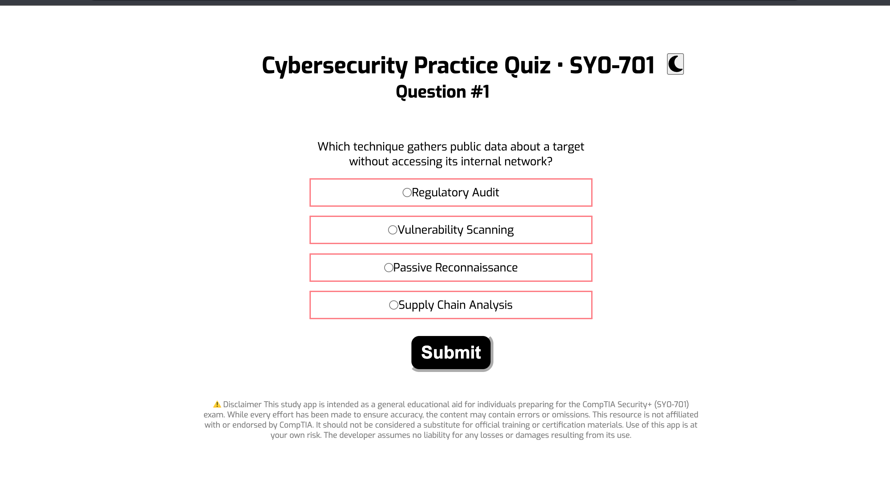

# Cybersecurity Quiz App 
_A self-built practice app for SY0-701 Security+ exam objectives_

---

  

---

##  About This Project

A personal study project designed to reinforce understanding of the SY0-701 Security+ exam topics through interactive practice quizzes.

- Written in **HTML, CSS, and JavaScript**
- Features a dynamic quiz interface
- Tracks correct and incorrect answers
- Shows score and percentage after each question
- Responsive layout with light/dark mode toggle
